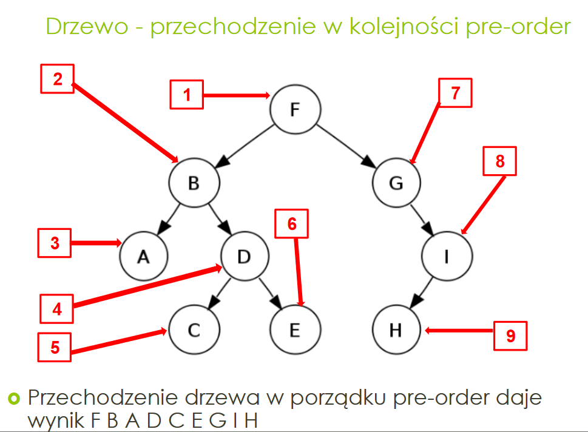
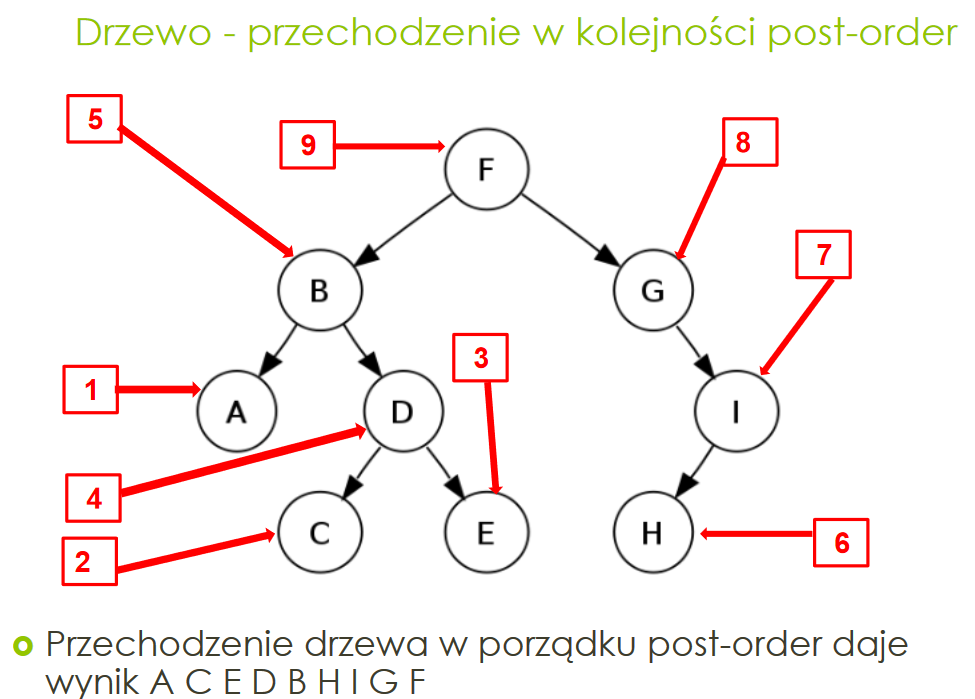
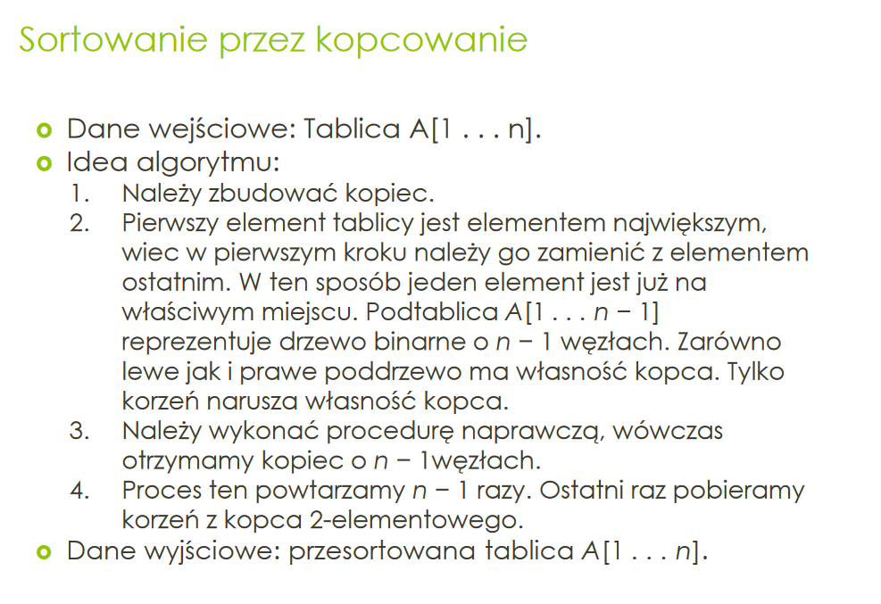
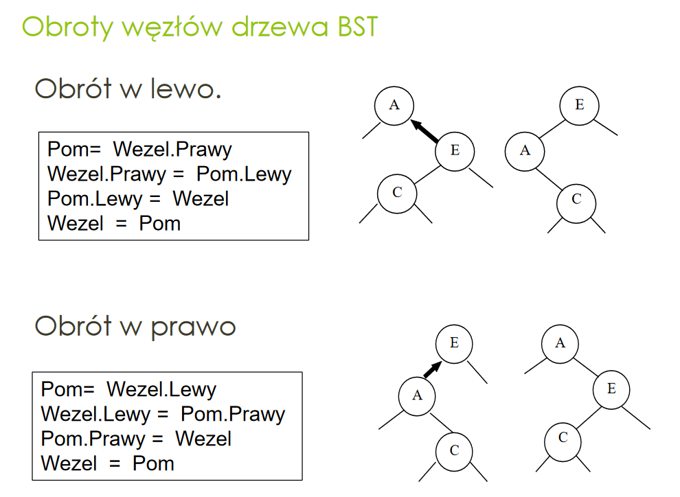
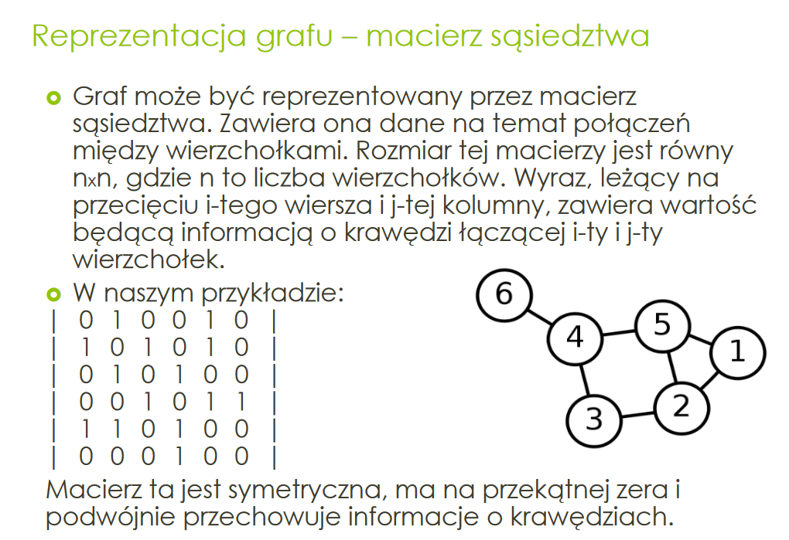
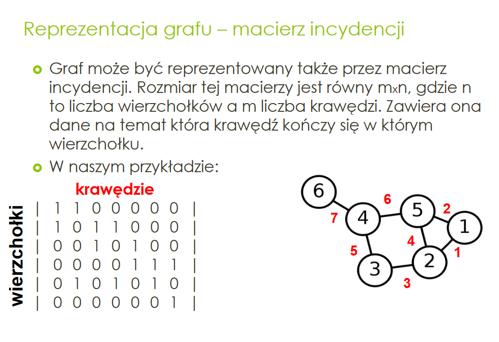
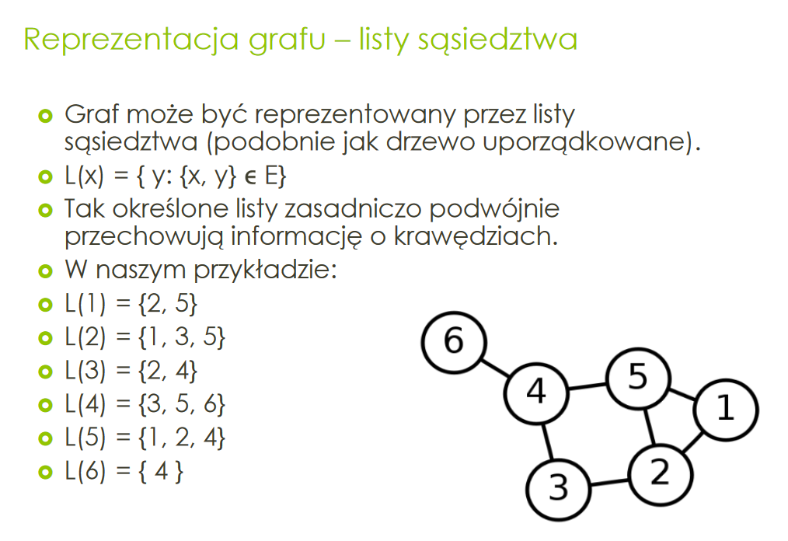
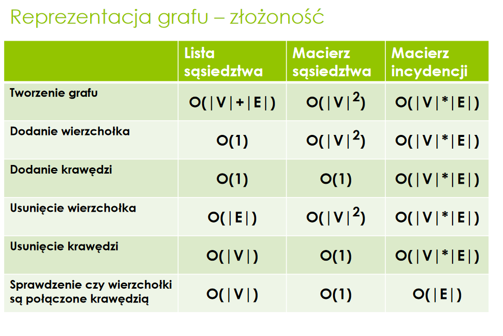
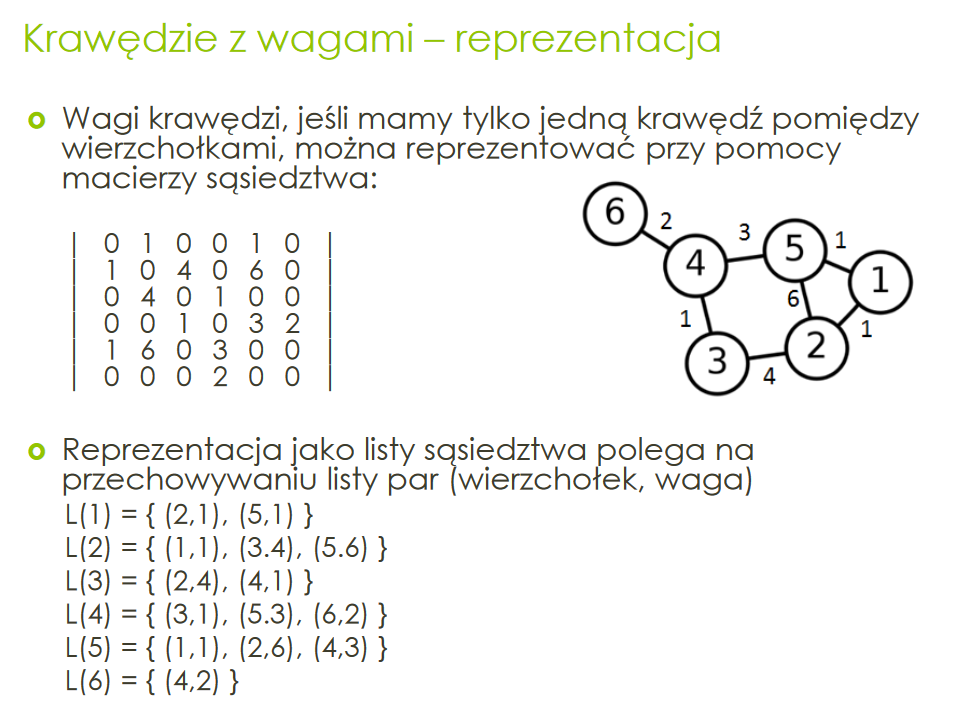
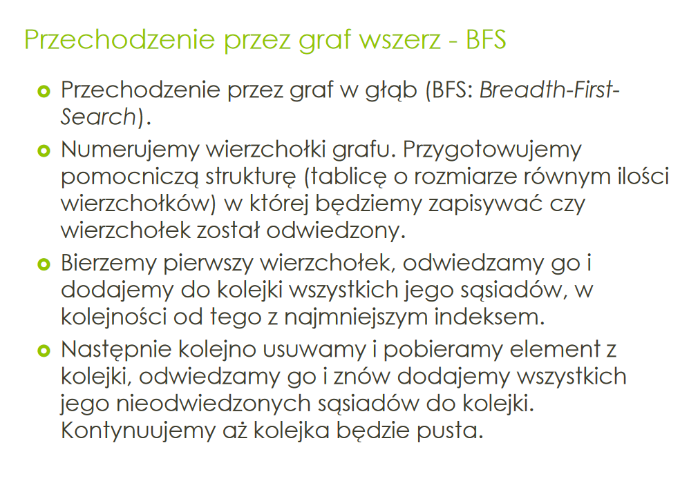

# Algorytmy
Materiały na drugi kolos z Algorytmów i Danych Struktur.
**Wyświetlanie Pre-order z nawiasami** najlepszą metodą na ogarnięcie struktury!

Debugowanie!!!
- **F10** - przenosi wykonanie do następnej linijki (step over)
- **F11** - wchdozi do funkcji (step into)

## Lab 8 - Lista, Stos, Kolejka
- [Stos (LIFO)](StosLIFO/Program.cs)
    - [Sprawdzenie poprawności nawiasów w wyrażeniu za pomocą stosu](Stos-SprawdzeniePoprawnosciNawiasow/Program.cs)
- [Kolejka (FIFO)](KolejkaFIFO/Program.cs)
    - [Kolejka (zbudowana za pomocą dwóch stosów)](KolejkaNaDwaStosy/Program.cs)
- [Lista jednokierunkowa](ListaJednokierunkowa/Program.cs)
    - [Lista posortowana (jednokierunkowa)](ListaPosortowana/Program.cs)
- [Lista dwukierunkowa](ListaDwukierunkowa/Program.cs)

## Lab 9 - Drzewa, Drzewa binarne
- [Drzewo](Drzewo/Program.cs)
    - [Drzewo potomków Adama](DrzewoPotomkowAdama/Program.cs)
- [Drzewo binarne](DrzewoBinarne/Program.cs)
- [Drzewo Trie](DrzewoTrie/Program.cs)
- *Do dokończenia* [Drzewo Huffmana](DrzewoHuffmana/Program.cs) - [>>ZOBACZ OPIS<<](DrzewoHuffmana/README.md) - rodzaj drzewa binarnego, gdzie znakom które występują najczęściej powinniśmy przyporządkować kody najkrótsze, które występują najrzadziej kody dłuższe.

## Lab 10 - Kopiec binarny
- [Kopiec binarny](KopiecBinarny/Program.cs) - implementacja tablicowa (budowanie kopca, liczenie wysokości, ilości liści, itp)
- [Sortowanie przez kopcowanie](SortowaniePrzezKopcowanie/Program.cs) - implementacja tablicowa
- [Kopiec binarny - implementacja jako drzewo binarne](KopiecBinarnyJakoDrzewo/Program.cs)
- [Kolejka Priorytetowa](KolejkaPriorytetowa/Program.cs)

## Lab 11 - Drzewa BST
- [Drzewo BST](DrzewoBST/Program.cs) - 500 linii kodu w tej zdradzieckiej strukturze... ;)

## Lab 12 - Zbiory, Hashowanie
- [Zbiór na wektorze charakterystycznym z adresowaniem bezpośrednim](ZbiorNaWektorzeCharakterystycznym/Program.cs)
- [Zbiór na tablicy z haszowaniem z metodą łańcuchową](ZbiorHashowanieZMetLancuchowa/Program.cs) - korzysta z wbudowanego GetHashCode()
    - [Zbiór na tablicy z haszowaniem (własnym) z metodą łańcuchową](ZbiorZWlasnymHashemZMetLancuchowa/Program.cs) - korzysta z własnej implementacji funkcji hashującej
- [Zbiór na tablicy z haszowaniem z adresowaniem otwartym](ZbiorHashowanieZAdresowaniemOtwartym/Program.cs) - korzysta z wbudowanego GetHashCode()
- [Zbiór na Hashtable z .NET](ZbiorHashtable/Program.cs) - zbiór oparty o wbudowaną strukturę danych (z .NET) `Hashtable`
- *Do dokonczenia* [Struktura Union-Find na tablicy z ustalonym przedziałem](#)
    - *Do dokonczenia* [Union-Find na liście dowiązaniowej](#)
    - *Do dokonczenia* [Union-Find jako drzewo](#)

## Lab 13 - Grafy
- [Graf nieskierowany](Graf/Program.cs) - (macierz sąsiedztw, listy sąsiedztwa, BFS, DFS)
- *Do dokonczenia* [Algorytm Dijkstry](#/Program.cs)

## **Kolos nr 2**
- [Zadania przykładowe - kolos nr 2](Kolos2_PrzykladoweZadania/)

# Opisy

## Drzewo
- **Stopień węzła w drzewie** - to liczba jego następników (liczba dzieci)
- **Liść** - węzeł bez następników (bez dzieci)
- **Węzeł wewnętrzny** - to węzeł, który nie jest liściem (czyli ma następników / dzieci)
- **Poziom węzła** - długość ścieżko od korzenia do tego węzła
- **Wysokość drzewa** - to największy poziom węzła w tym drzewie

## Rodzaje drzew binarnych
 - **Regularne drzewo binarne** to takie drzewo binarne, którego węzły mają stopień parzysty (czyli dwa lub zero).
 - **Zupełne drzewo binarne** to drzewo binarne, w którym wszystkie poziomy są wypełnione całkowicie, z wyjątkiem co najwyżej ostatniego - spójnie wypełnionego od lewej strony
 - **Pełne drzewo binarne** - to regularne drzewo binarne, w którym wszystkie liście mają ten sam poziom

## Przechodzenie przez drzewo
- **PRE-ORDER** - najpierw odwiedzamy poprzednik, a następnie jego następniki w kolejności od lewej do prawej.

- **POST-ORDER** - najpierw odwiedzamy następniki węzła, a dopiero potem sam węzeł

- **IN-ORDER** (tylko w drzewie binarnym) - 
    - przejdź lewe pod-drzeweo,
    - odwiedź korzeń,
    - przejdź prawe pod-drzewo
In order w drzewie BST wyświetla elementy tak, jak by były posortowane

## Drzewo Trie

## Drzewo Huffmana [>>Zobacz opis<<](./DrzewoHuffmana/README.md)

## Kopiec binarny
Kopiec binarny (binary heap - stóg, sterta) to zupełne drzewo binarne, spełniające warunek kopca: dla każdego węzła X wartość następnika nie jest większa niż wartość X

- **Warunek istnienia kopca** - dla każdego węzła X, wartość następnika jest nie większa niż wartość X. Jeśli X ma indeks `i` to następniki mają indeksy `2*i+1` oraz `2*i+2`
- **Liczba węzłów** - Na 0-wym poziomie jest jeden węzeł, czyli `2^0`. 
    - Na 1-szym poomie są 2 węzły, bo `2^1`. 
    - ... 
    - Na `(h-1)` poziomie jest `2^(h-1)` węzłów. 
    - Na ostatnim poziomie jest od 1 do `2^h` węzłów
- **Najmniejsza liczba węzłów** 1+2+4+...+ 2^(h-1) +1 = 2^h
- **Największa liczba węzłów**  1+2+4+...+ 2^(h-1) +2^h = 2^(h+1) -1
- **Ilość liści i ilość węzłów wewnętrznych:**
    - Liczba liści jest nie mniejsza niż liczba węzłów wewnętrznych
    - Ale jednocześnie węzłów wewnętrzych nie może być mniej niż liści o więcej niż 1
    - Czyli albo liści jest tyle co wewnętrznych gdy n parzyste
    - Albo liczba liści jest o 1 większa gdy n - nieparyste
- Gdzie w kopcu można znaleźć element najmniejszy? -> **W liściach**
-  Czy tablica, która jest odwrotnie posortowana (tzn. nierosnąco), jest kopcem? -> **Tak**

## Sortowanie przez kopcowanie

## Drzewo BST
- **IN-ORDER** wyświetla drzewo, wypisując elementy posortowane
- Dzięki wyświetlaniu **PRE-ORDER** w notacji z nawiasami możliwe jest łatwe narysowanie drzewa na kartce
- Wykaż, że czas przechodzenia drzewa w porządku in-order jest liniowy => wystarczy do metody wyświetlającej in-order dodać licznik kroków(tzn. ilość wywołania tej funkcji). Później wysarczy to zliczyć, by zobaczyć, że liczba wywołań funkcji jest taka sama jak ilość węzłów.
- Rotacje (obroty):

## Grafy
- **Macierz sąsiedztwa**

- **Macierz icydencji**

- **Listy sąsiedztwa**

- **Złożoność grafu**

- **Krawędzie z wagami**

- **DFS** - przechodzenie przez graf w głąb - DepthFirstSearch

- **BFS** - przechodzenie przez graf wszerz - BreadthFirstSearch

# Słowniczek
- Node - węzeł
- root - korzeń
- leaf - liść
- value - wartość
- children - dzieci
- parent - rodzic
- head - głowa
- rear - tył (ogon)
- Tree - drzewo
- Stack - stos
- Queue - kolejka
- Init - zainicjować (nadać wartość początkową)
- Show - pokaż (wyśiwetl)
- Get - weź (pobierz)
- Height - wysokość
- Length - długość (wielkość)
- left / right - lewe / prawe (dziecko, poddrzewo, węzeł)
- prev / next - poprzedni / następny
- Search - szukaj
- Insert - wstaw
- word - wyraz, słowo
- Empty - pusty

# Lista metod w strukturach danych
- Stos (Stack)
    - `Push()` - wrzuca element na wierzchołek stosu
    - `Pop()` - zwraca element z wierzchołka i go usuwa
    - `Peek()` - zwraca element z wierzchołka bez jego usuwania
    - `Empty()` - zwraca true, jeśli stos jest pusty
- Kolejka (Queue)
    - `Enqueue()` - dodaje element na koniec kolejki (Add, Insert)
    - `Dequeue()` - usuwa element z początku kolejki (Remove)
    - `Peek()` - zwraca (bez usuwania) element z początku kolejki
- Lista (List)
    - #
- Drzewo (Tree)
    - #
- Kopiec (Heap)
    - `Heapify()`
    - `Build()`
    - `Insert()` - wstawia element do kopca
    - `ExtractMax()` - zwraca i usuwa największy element z kopca. Następnie na to miejsca wrzuca element najmniejszy
    - `Maximum()` - zwraca (bez usuwania) największy element kopca
    - `HeapSort()` - sortowanie przez kopcowanie
- Graf (Graph)

